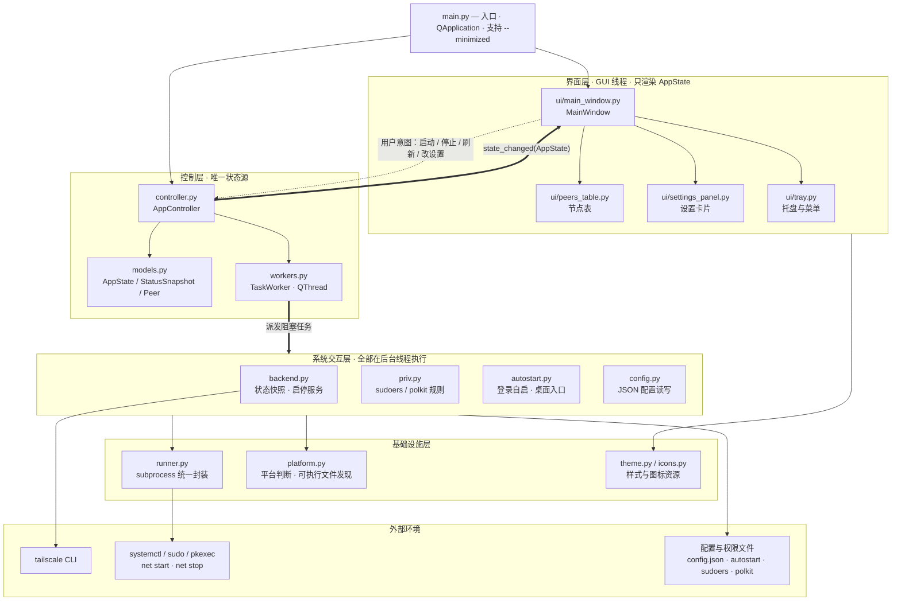
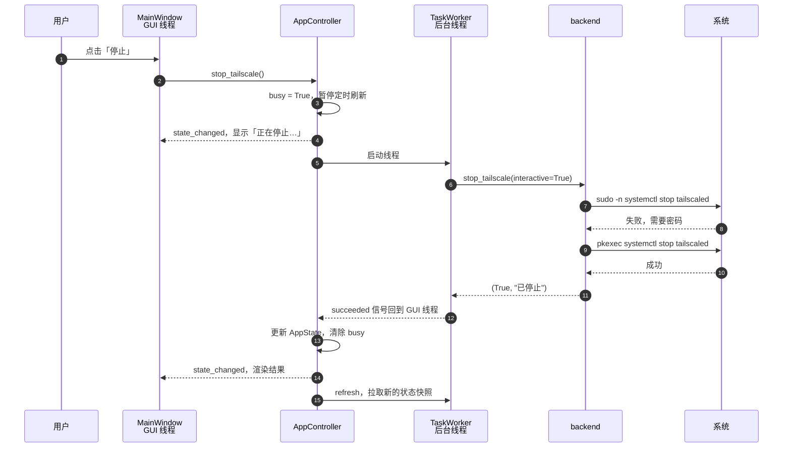

# tsctl — Tailscale 简易管理界面

A lightweight desktop app to start/stop Tailscale, view peers, and manage login autostart—without leaving the tray.

跨平台小工具：启停 Tailscale、查看节点状态。  
界面：**PyQt5**；逻辑调用本机已安装的 `tailscale` / `tailscaled`。

## 支持平台

| 平台 | 说明 |
|------|------|
| Ubuntu 18.04+ | 使用 **`python3`** + `python3-pyqt5`（系统 `python` 常为 2.7，不可用）。启停优先 `sudo -n systemctl`，否则 `pkexec` |
| Windows 10+ | 官网 Python 3 + `pip install PyQt5`；启停 Windows 服务 `Tailscale`，并 `up`/`down` |

需本机已安装 [Tailscale](https://tailscale.com/download)。

## 功能（当前已实现）

- 启动 / 停止本机 Tailscale 服务；按钮下方显示「正在启动/停止…」与结果（成功不再弹「完成」对话框）
- 后台刷新 `tailscale status --json`（约 3 秒一次；不会阻塞界面）
- 显示本机 Tailscale IPv4
- **节点列表**：名称 / IP / 系统 / 在线状态 / 直连或 DERP；双击复制 IP
- **系统托盘**：关闭窗口最小化到托盘；右键启动/停止/刷新/退出；图标绿=运行中
- **设置**
  - 开机（登录桌面后）自动启动本工具（Linux: `~/.config/autostart/tsctl.desktop`；Windows: 启动文件夹 bat）
  - 本工具启动时是否自动启动 Tailscale；勾选且无免密时提示安装最小权限（见下）
  - 由本工具拉起的 Tailscale，退出工具时会停止；进入前已在运行则不关

配置文件：`~/.config/tsctl/config.json`（Windows: `%APPDATA%\tsctl\config.json`）

### Linux 免密启停（登录自启时用）

勾选「本工具启动时自动启动 Tailscale 服务」时，若检测到仍需密码，会弹出说明并用 `pkexec` 安装：

- `/etc/sudoers.d/tsctl-tailscaled`：仅允许当前用户 `systemctl start|stop|restart tailscaled`（Ubuntu 20.04 等 polkit 0.105 无法按单个 unit 精确放行，以此为主）
- `/etc/polkit-1/rules.d/49-tsctl-tailscaled.rules`：新版 polkit 可用的同范围规则

取消勾选时可选择删除上述文件。手动启停顺序：`sudo -n` → `pkexec`；登录自动启动不会弹出密码框，免密不可用时会快速报错。

## 运行

```bash
# Ubuntu
sudo apt install python3-pyqt5   # 若未安装
cd /path/to/tsctl
python3 main.py
# 开机自启时会带 --minimized，只进托盘
```

```bat
REM Windows（在项目目录）
pip install PyQt5
python main.py
```

## 架构

分四层：界面只负责渲染和上报意图，控制层持有唯一状态，系统交互层在后台线程里跑所有可能阻塞的命令，基础设施层统一平台判断与 `subprocess` 调用。



图中省略两处轻量旁路：界面层对 `backend` 和 `priv` 各有一处只读引用，取底部平台提示文案和免密权限说明对话框的正文，不经由它们发起命令；`AppController` 保存设置时直接调用 `config.save()`，这次写入只有几十字节，不进后台线程。

### 一次「停止」的线程时序

所有会卡住的调用都在 `TaskWorker` 里，界面在等待期间保持可交互：



### 几条贯穿全局的约定

- **单向数据流**：`AppState` 是唯一状态源，界面不保存业务状态，只在 `render()` 里按 `AppState` 重画。
- **信号参数**：`clicked(bool)` 会占用槽函数第一个参数，连接控制器方法时用 `lambda` 丢弃它，否则 `interactive` 会被置成 `False` 而拿不到 `pkexec` 提权。
- **一次查询出全部状态**：`backend.fetch_snapshot()` 只发一条 `tailscale status --json`，从中派生运行状态、本机 IP、节点列表和原始文本。
- **服务归属**：仅当本工具把处于停止状态的服务拉起时才置 `started_by_us`，退出时据此决定是否停服务。

## 目录

```text
main.py           # 入口（支持 --minimized）
tsctl/
  controller.py   # 状态、后台任务和生命周期
  models.py       # AppState / StatusSnapshot / Peer
  workers.py      # 通用后台任务
  backend.py      # Tailscale 状态快照和启停
  runner.py       # 统一 subprocess 执行
  platform.py     # 平台与可执行文件发现
  config.py       # JSON 配置
  autostart.py    # Linux/Windows 登录自启与桌面入口
  icons.py        # 应用与托盘图标
  priv.py         # Linux 免密 sudoers / polkit
  theme.py        # Qt 样式
  ui/
    main_window.py
    peers_table.py
    settings_panel.py
    tray.py
  gui.py          # 旧导入路径兼容层
icons/            # 启动时生成的图标缓存（不入库）
tests/            # unittest 核心测试
requirements.txt
```

## 测试

```bash
python3 -m unittest discover -s tests -v
```

## 说明

- Linux：一次 `tailscale status --json` 生成运行状态、IP、节点和原始状态；查询失败时再用 `systemctl is-active` 兜底。
- Windows：启动会尝试 `net start Tailscale` 再 `tailscale up`；停止优先 `tailscale down`，服务可仍在后台（避免误伤托盘安装）。
- 本工具不重新实现 WireGuard / DERP，只做管理壳。
